<div align="center">
    <h1>☀️ HyprNoon ☀️ by Pharmaracist</h1>
    <p align="center">
      
    </p>
</div>

<div align="center">

[](https://github.com/pharmaracist/HyprNoon/stargazers)
[](https://archlinux.org/)
[](https://hyprland.org/)
[]()
[](https://discord.gg/qE4JY7d7GZ)

</div>

<div align="center">
    <h2>Spaghetti Coded Dotfiles for Hyprland made with AGS</h2>
</div>


## 📚 Table of Contents
- [Features](#-features)
- [Getting The Dots](#-getting-the-dots-)
- [Showcase](#%EF%B8%8F-showcase)
- [Credits](#-credits)
- [Contributing](#-contributing)
- [License](#-license)

## ✨ Features
- **Aim**: The main focus is to provide a Flexible Experience, While using it its for your imagination.
- **User-Friendly**: Designed for ease of use, ensuring a smooth experience for all users.
- **Feature-Rich**: Packed with functionalities to enhance your desktop environment.
- **Resource-Friendly**: Optimized to use minimal system resources while providing maximum performance.

## 🌟 Getting the Dots 🌟
### 💻 Cloning This Repo:
If you prefer to see what's being installed, you can manually clone and run the installation script:

```bash
# Clone the repository
git clone https://github.com/pharmaracist/dots-hyprland.git

# Change to the directory
cd dots-hyprland

# For Arch Linux
./install.sh
```

### 💻 Using Our Install Script:
```bash
bash <(curl -s "https://raw.githubusercontent.com/os-guy/HyprNoon/refs/heads/main/setup.sh")
```

**AFTER THE INSTALLATION, PLEASE TRY TO CHANGE YOUR WALLPAPER 2-3 TIMES BY HITTING `CTRL+SUPER+T`**

## 🖼️ Showcase
<div align="center">

  | Titles | Screenshots                                                                                                                                                                                                                                                                                                                                                                                                                                                                                                                                                                                                                                                                                     |
| -------- | ----------------------------------------------------------------------------------------------------------------------------------------------------------------------------------------------------------------------------------------------------------------------------------------------------------------------------------------------------------------------------------------------------------------------------------------------------------------------------------------------------------------------------------------------------------------------------------------------------------------------------------------------------------------------------------------------- |
| Tweaks     |  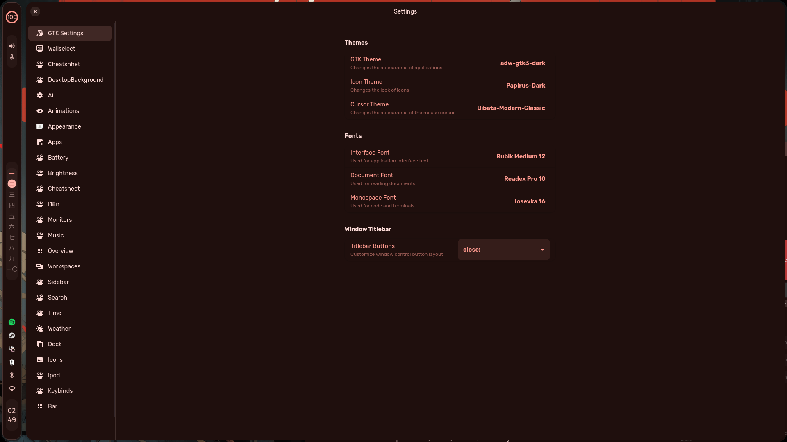                                                                                                                                                                                                                                      |
| Themeing stuff    |  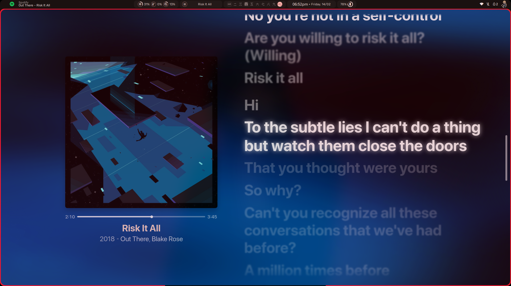 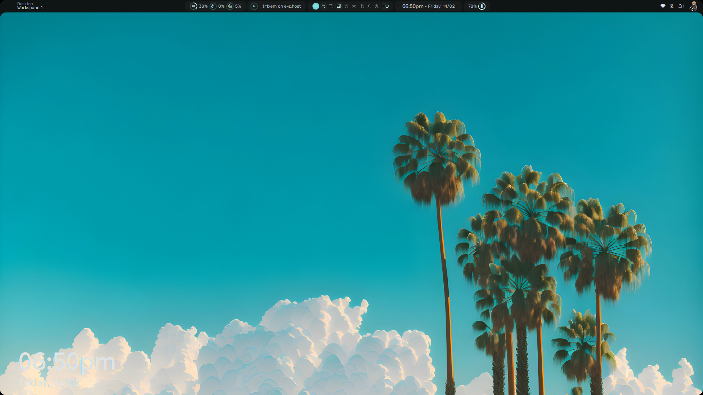  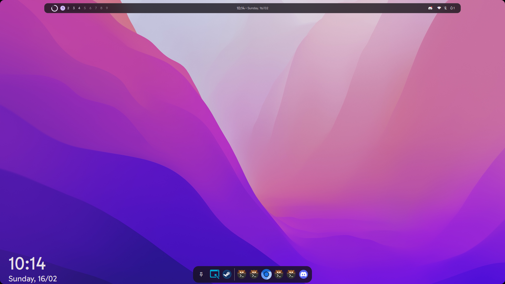                                                                                                                                                                                                                                                                                                                                                 |
| Sidebars & Media Control  |  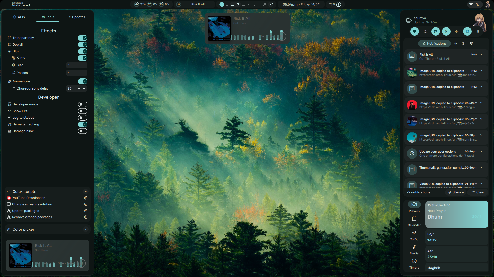 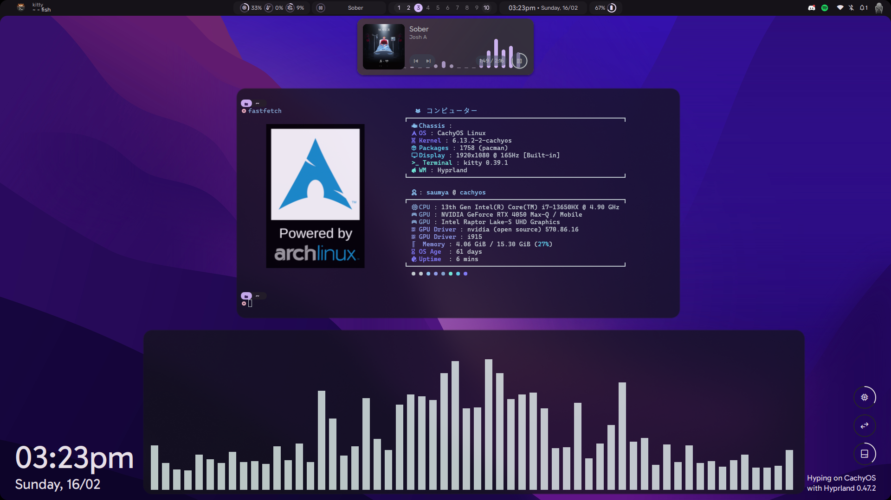 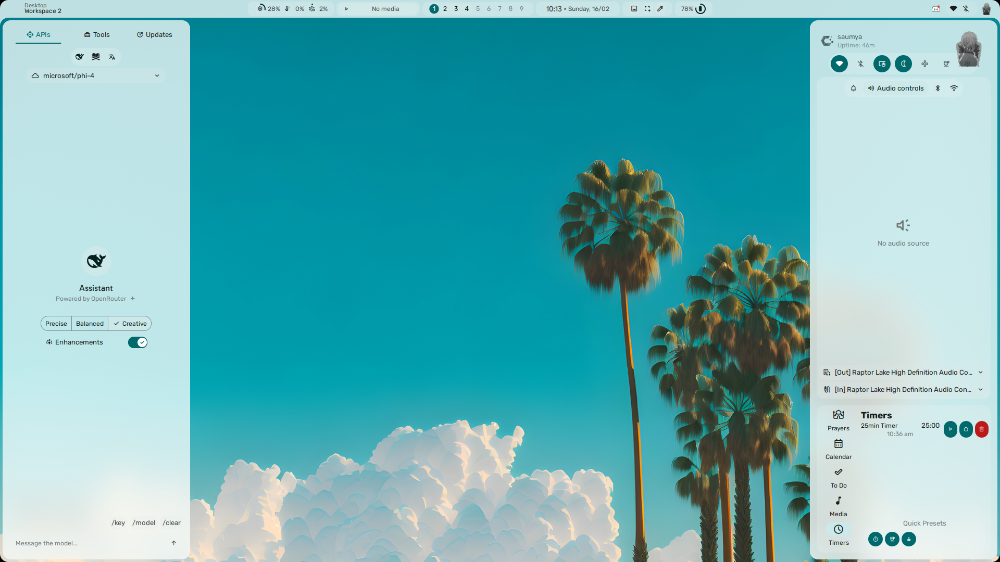 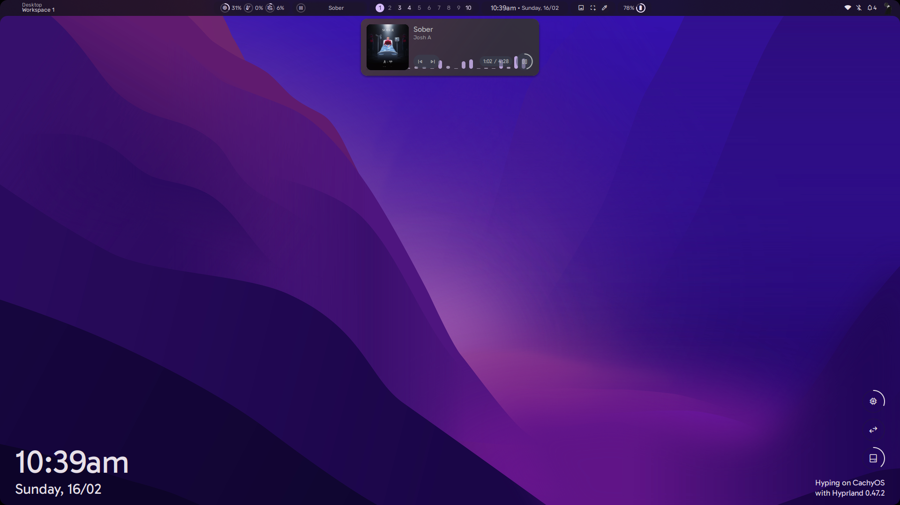
| Read Qur'an     |                                                                                             |
| More From Desktop     |   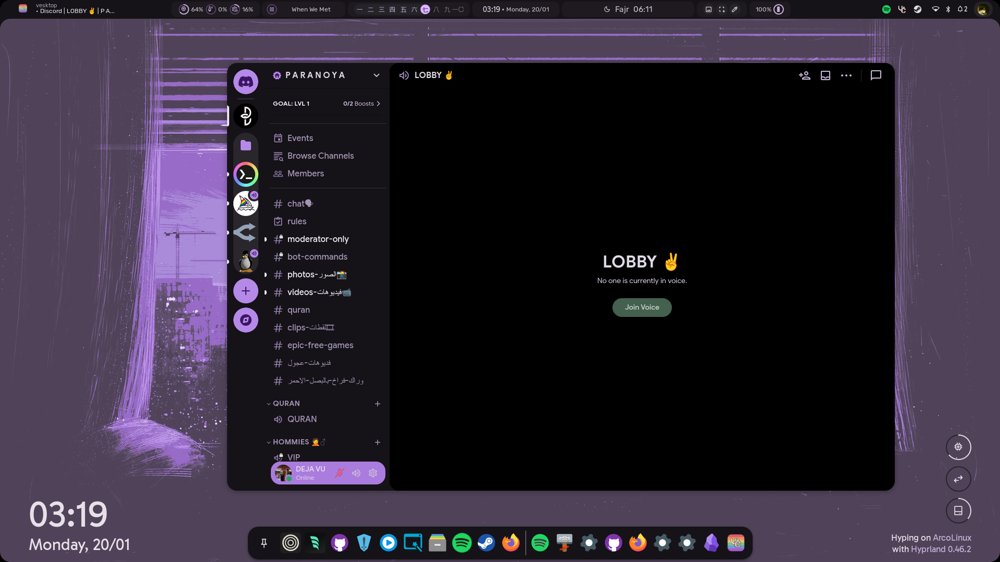 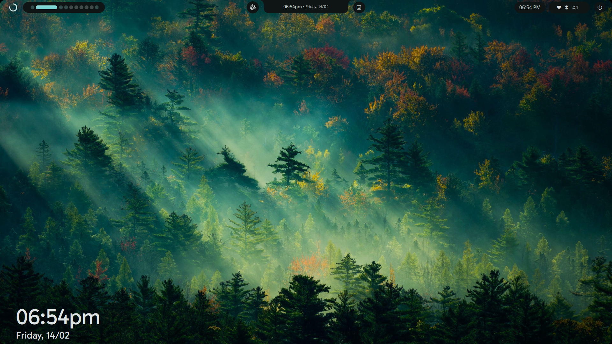  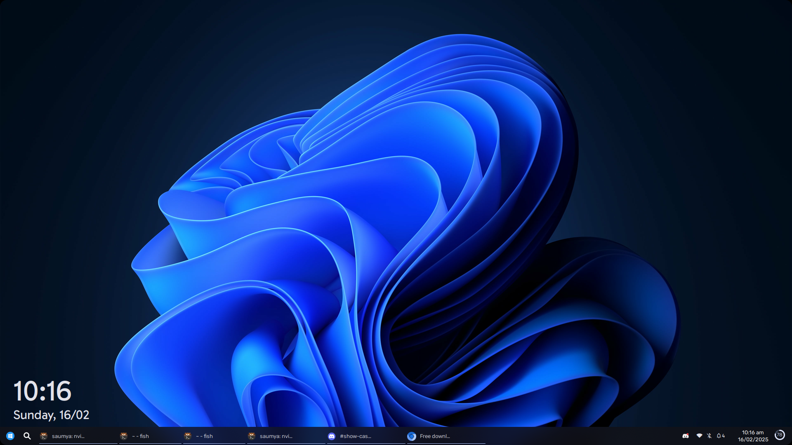

</div>

## 🙏 Credits
- My gf - She supported me a lot.
- [end-4](https://github.com/end-4) - For the main dotfile of this beautiful creation.
- [Sh1zicus](https://github.com/sh1zicus) - For the great kick-start of this dotfile.
- [os-guy](https://github.com/os-guy) - For the installer and structure.
- [tr1x_em](https://github.com/tr1xem) - For Misc fix and help.

## 🤝 Contributing
We welcome contributions! Please feel free to submit a pull request or open an issue if you have new ⭐ feature requests ⭐ or found some 🪲 bugs 🪲 !

## 📜 License
This project is licensed under the MIT License. See the [LICENSE](https://github.com/pharmaracist/HyprNoon/blob/main/LICENSE) for more details.
