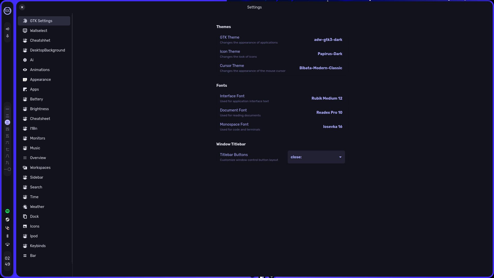
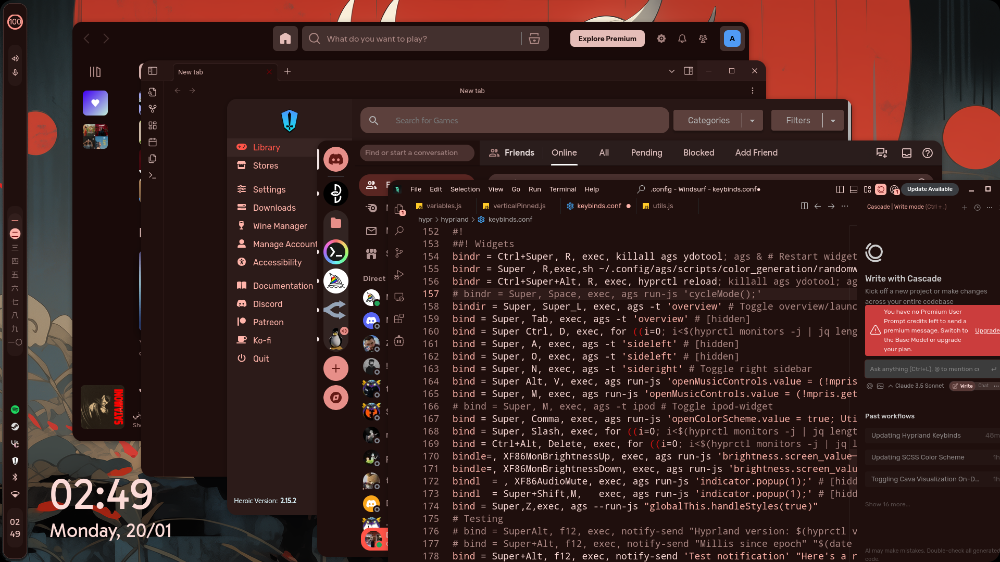
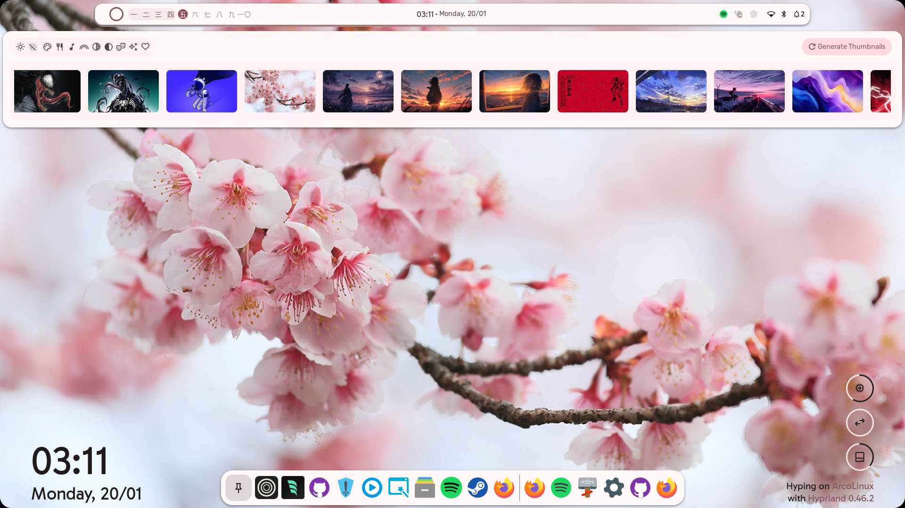
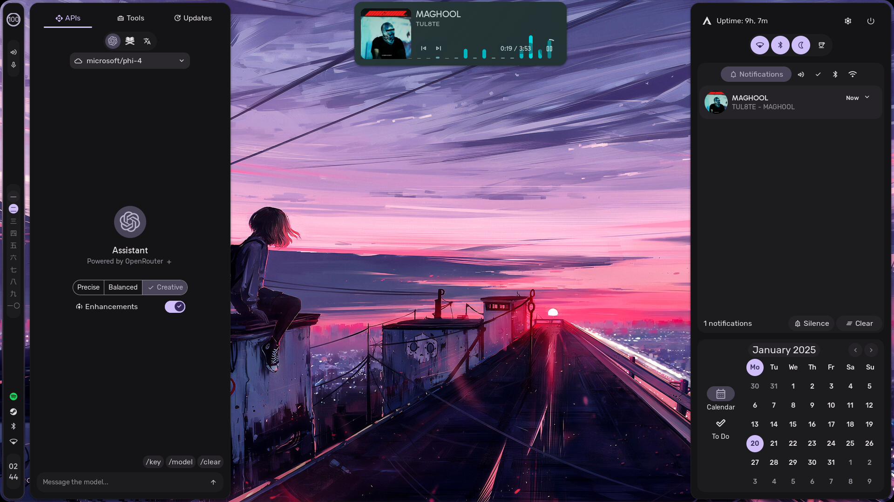
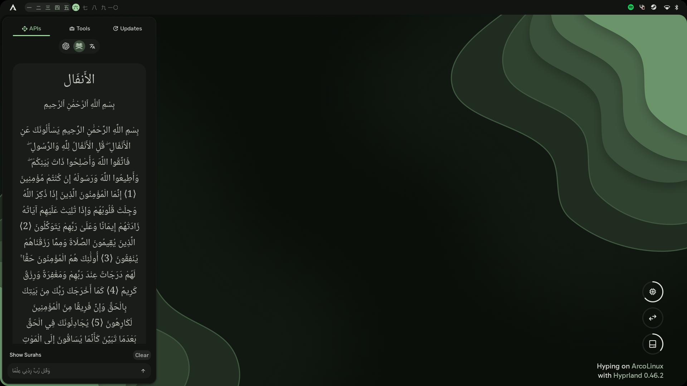
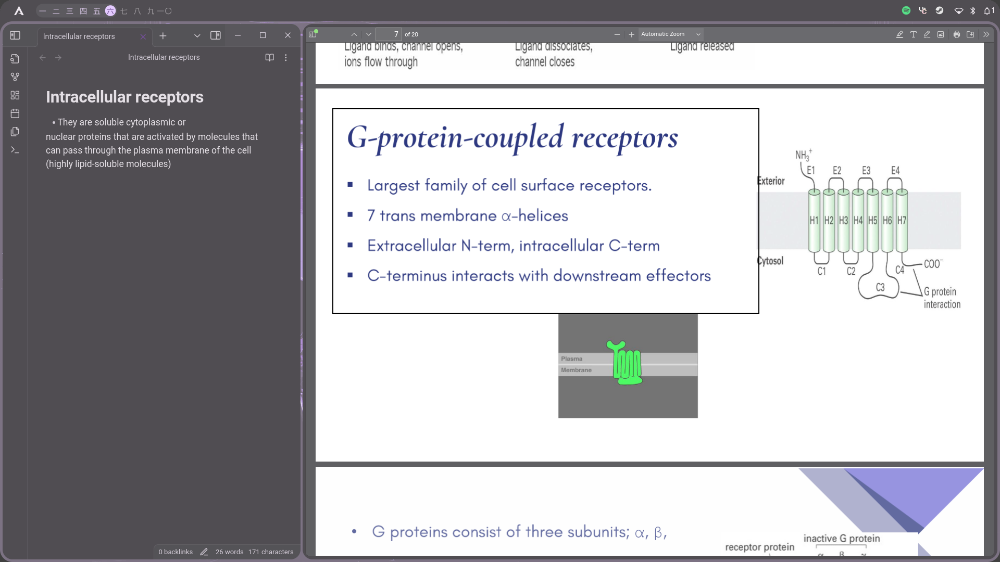

<div align="center">
    <h1>【 Pharmaracism's HyprNoon 】</h1>
    <p align="center">
      
    </p>
</div>

<div align="center"> 

[](https://github.com/pharmaracist/dots-hyprland/stargazers)
[](https://github.com/pharmaracist/dots-hyprland/commits/main)
[](https://github.com/pharmaracist/dots-hyprland)
[](https://github.com/pharmaracist/dots-hyprland/blob/main/LICENSE)
[](https://github.com/pharmaracist/dots-hyprland/issues)
[](https://archlinux.org/)
[](https://hyprland.org/)

</div>

<div align="center">
    <h2>🌟 My Personal Spaghetti Coded Dotfiles on Hyprland/AGS 🌟</h2>
</div>

<p align="center">
  
  
  
</p>

## 📚 Table of Contents
- [Features](#-features)
- [Installation](#-installation)
- [Screenshots](#-screenshots)
- [Credits](#-credits)
- [Contributing](#-contributing)
- [License](#-license)

## ✨ Features
- **Aim**: The main focus is to provide a Flexible Experience While using it its for your imagination.
- **User-Friendly**: Designed for ease of use, ensuring a smooth experience for all users.
- **Feature-Rich**: Packed with functionalities to enhance your desktop environment.
- **Resource-Friendly**: Optimized to use minimal system resources while providing maximum performance.

## 🚀 Installation
### 💻 Manual Installation:
If you prefer to see what's being installed, you can manually clone and run the installation script:

```bash
# Clone the repository
git clone https://github.com/pharmaracist/dots-hyprland.git

# Change to the directory
cd dots-hyprland

# For Arch Linux
./install.sh
```

## 🖼️ Pics

<div align="center">
  <details open>
    <summary>📸 Screenshots</summary>
    <br/>
    
  <div style="display: grid; grid-template-columns: repeat(2, 1fr); gap: 10px;">
    
    
    
    
    
    
    
    
    
  </div>

  </details>
</div>

## 🙏 Credits
- Special thanks to my girlfriend for the support!
- Acknowledgements to End-4 for the original Hyprland rice.
- Thanks to Sh1zicus for the help and the awesome kickstart.

## 🤝 Contributing
We welcome contributions! Please feel free to submit a pull request or open an issue if you have suggestions or improvements.

## 📜 License
This project is licensed under the MIT License. See the [LICENSE](https://github.com/pharmaracist/dots-hyprland/blob/main/LICENSE) file for details.

*Note: This README was made by AI cuz im too lazy to write it myself! ..Pharmaracist*
